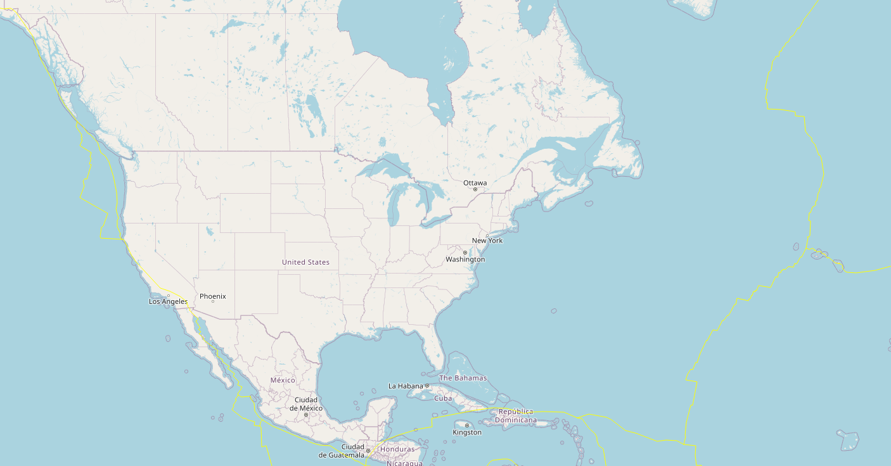

# leaflet-challenge
## GA Tech Data Science and Analytics Boot Camp Module 15
### Description

In this module, we utilize Javascript and the Leaflet library to display seismic activity on a map based off the <a href="https://earthquake.usgs.gov/earthquakes/feed/v1.0/geojson.php">United States Geological Survey (USGS)</a>.

To start creating the different layers of the map, we use the <a href="https://leaflet-extras.github.io/leaflet-providers/preview/">leaflet providers</a> resource. This project specifically displays a grayscale, water color, topography, and generic tile layer.

Next, we have the <a href="https://raw.githubusercontent.com/fraxen/tectonicplates/master/GeoJSON/PB2002_boundaries.json">tectonic plates dataset</a> that draws a yellow line on the map where the plates are located.

Then we have the <a href="https://earthquake.usgs.gov/earthquakes/feed/v1.0/summary/all_week.geojson">earthquake dataset</a> that provides the locations for an occurrence of an earthquake of the last 7 days.

Finally, we add a legend to the map to give some context to the data points.

The final product looks like this:

### Submission Requirements

* Link to site can be found <a href="https://aimeevu.github.io/leaflet-challenge/">here</a>.
